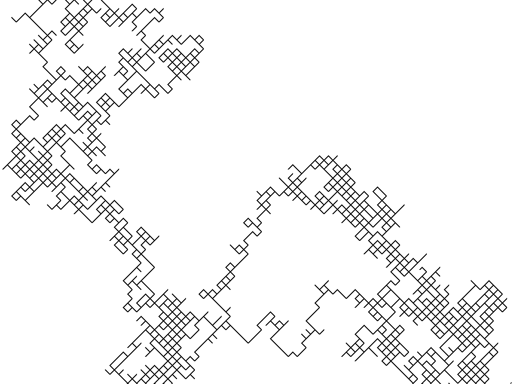
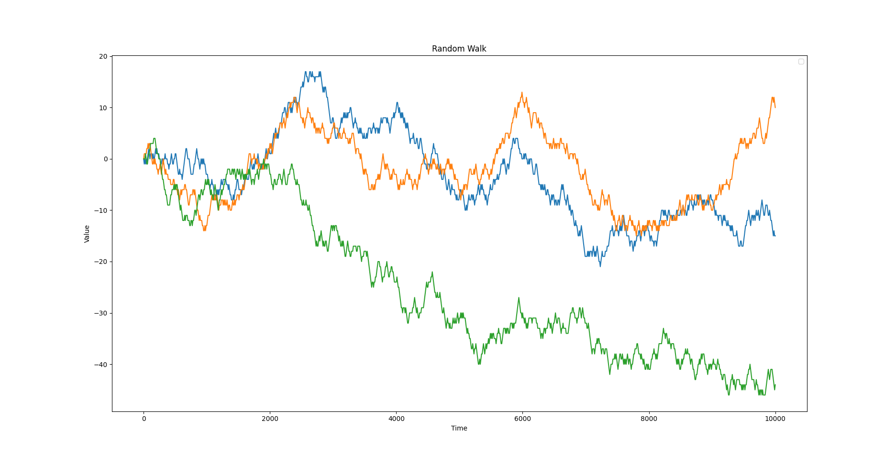

# Random Walk

In mathematics, a random walk is a random process that describes a path that
consists of a succession of random steps on some mathematical space.

[Wikipedia](https://en.wikipedia.org/wiki/Random_walk)

### Two Dimensional Visual Representation

Built with [Turtle](https://docs.python.org/3/library/turtle.html).

### Graphical Representation of The Values Over Time in Three Subsequent Runs

The `blue`, `green` & `orange` plots represent three different runs of the algorithm.

## License

MIT

#### Author

Samarth Kulshrestha
