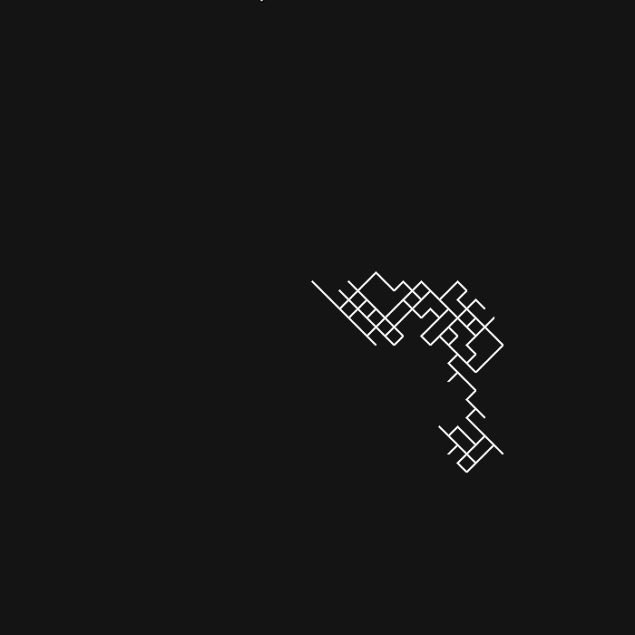

<h1>random walk</h1>

samarth kulshrestha

 

   
  

## Introduction

In mathematics, a [random walk](https://en.wikipedia.org/wiki/Random_walk)
is a random process that describes a path that consists of a succession of
discrete, random steps on some mathematical space. In a random walk, the final
position is entirely independent of the point of origin of the object.
Additionally, it is an example of the
[Markov Process](https://en.wikipedia.org/wiki/Markov_chain).

Examples of random walk include:
+ [one-dimensional random walk](https://en.wikipedia.org/wiki/Random_walk#One-dimensional_random_walk)
where an integer Z on the number line which starts
at 0, and at each step moves +1 or -1 with equal probability
+ [brownian motion](https://en.wikipedia.org/wiki/Brownian_motion)

#### Graphically Represented Values Over Time in Three Subsequent Runs of One-Dimensional Random Walk

The `blue`, `green` & `orange` plots represent three distinct runs of the algorithm.

#### Visually Represented 2-Dimensional Random Walk Algorithm

## License

samarthkulshrestha/random_walk is licensed under the MIT License.

Copyright (c) 2023 Samarth Kulshrestha.
